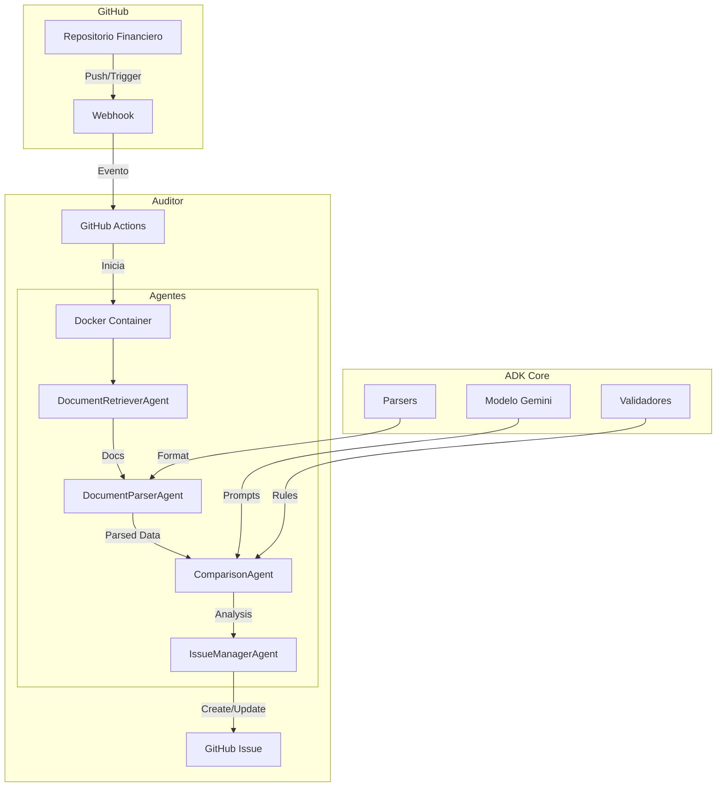

# Diagrama de Arquitectura - Sistema de Auditoría Financiera

## Leyenda

- **GitHub**: Repositorio fuente y sistema de eventos
- **Auditor**: Sistema principal de auditoría
- **ADK Core**: Núcleo del sistema de desarrollo autónomo
- **Flechas**: Flujo de datos y eventos
- **Subgraphs**: Agrupación lógica de componentes 