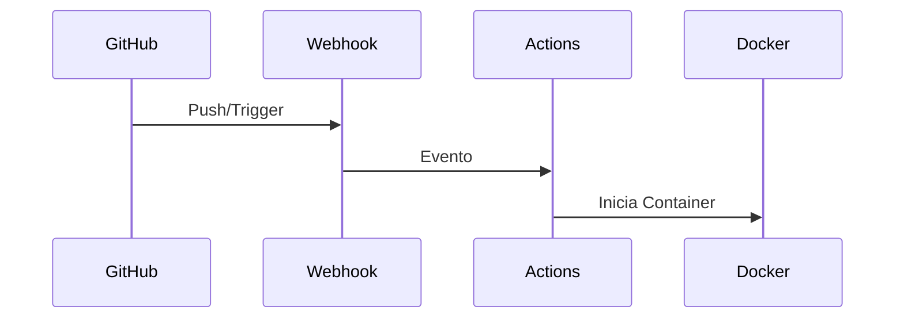
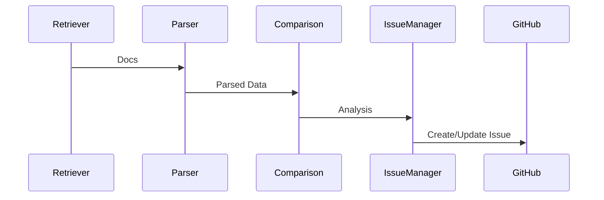
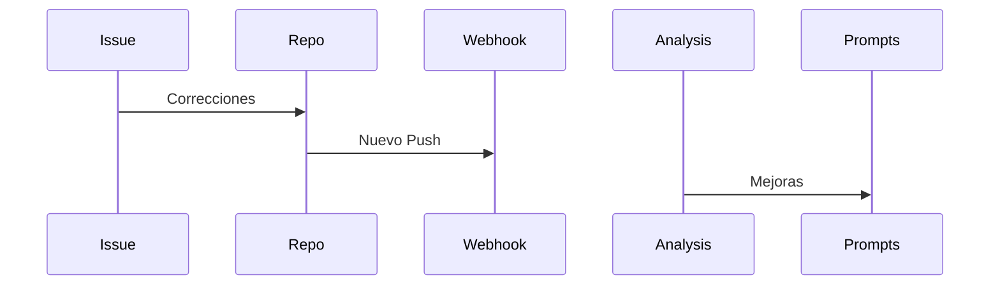

# Racionalización de Arquitectura

## Componentes Principales

### 1. GitHub Integration Layer
- **Webhook**: Captura eventos de push y triggers manuales
- **GitHub Actions**: Orquesta el flujo de trabajo
- **Docker Container**: Proporciona aislamiento y consistencia

### 2. Agent Layer
- **DocumentRetrieverAgent**: 
  - Obtiene documentos financieros
  - Maneja autenticación y permisos
  - Gestiona caché de documentos

- **DocumentParserAgent**:
  - Parsea documentos Markdown/CSV
  - Normaliza datos financieros
  - Valida formato y estructura

- **ComparisonAgent**:
  - Analiza consistencia entre documentos
  - Valida ecuaciones contables
  - Calcula ratios financieros

- **IssueManagerAgent**:
  - Crea/actualiza issues
  - Prioriza discrepancias
  - Sugiere correcciones

### 3. ADK Core
- **Modelo Gemini**: Procesamiento de lenguaje natural
- **Sistema de Prompts**: Reglas de validación financiera
- **Parsers**: Conversión de formatos

## Flujo de Datos

### 1. Trigger Flow

### 2. Processing Flow

### 3. Feedback Flow

## Modos de Fallo

### 1. Document Retrieval
- **Fallo en acceso**: Timeout o permisos insuficientes
- **Formato inválido**: Estructura no reconocida
- **Archivos faltantes**: Documentos no encontrados

### 2. Processing
- **Timeouts**: Análisis excede límites
- **Parsing**: Errores en conversión
- **Datos**: Inconsistencias en valores

### 3. Issue Management
- **Creación**: Fallos en API de GitHub
- **Permisos**: Tokens inválidos
- **Rate Limiting**: Límites de API excedidos

## Estrategia de Escalado

### 1. Horizontal Scaling
- **Docker**: Múltiples instancias
- **Webhooks**: Load balancing
- **Caché**: Documentos frecuentes

### 2. Vertical Scaling
- **Prompts**: Optimización de reglas
- **Parsers**: Mejora de rendimiento
- **Caché**: Resultados de análisis

### 3. Future Scaling
- **Formatos**: Soporte extendido
- **Repos**: Múltiples fuentes
- **Análisis**: Histórico y tendencias

## Métricas Clave

### 1. Performance
- **Procesamiento**: < 30 segundos por documento
- **Detección**: > 95% de discrepancias
- **Precisión**: < 1% de falsos positivos

### 2. Reliability
- **Uptime**: > 99.9%
- **Fallos**: < 0.1% de requests
- **Recuperación**: < 5 minutos

### 3. Business Impact
- **Errores**: Reducción del 90%
- **Tiempo**: Ahorro de 20 horas/semana
- **Calidad**: Mejora del 95% en reportes 